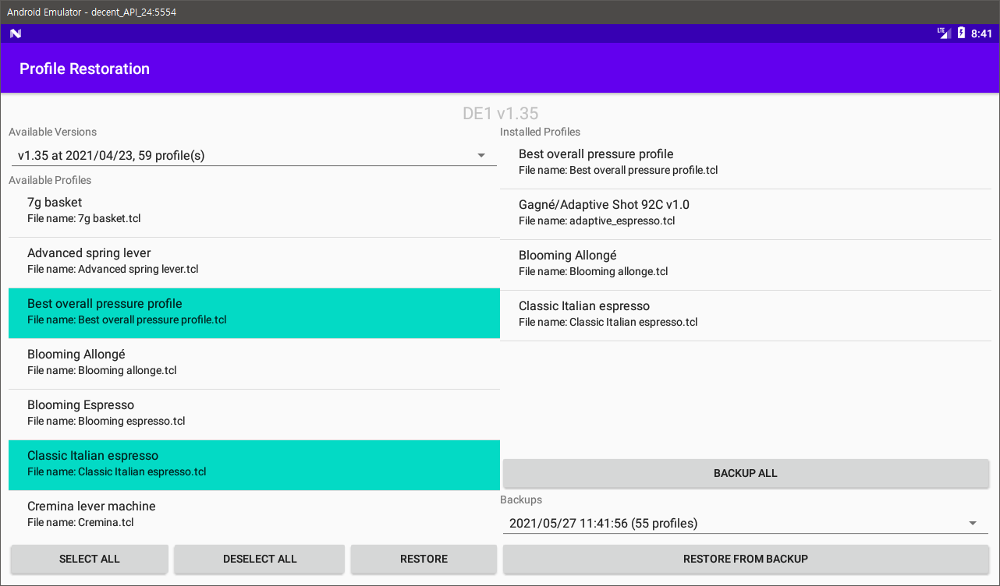

# Profile Restoration (for Decent Espresso tablet app)

is a supplemental Android app handling profile restoration through simple file operations.

Usage

1. Pick the DE1 app installation directory in the tablet internal/external storage
1. Perform whatever operations supported
    * Profile deletion is not supported. Use the profile selection pane in DE1 app
1. Completely restart the DE1 app

Supported features:

* Restore profiles from number of releases (auto-detected when you pick the installation directory)
* Backup current profiles
* Restore profiles from backup

Backups are stored in `_profile_backup` in the DE1 app installation directory.
